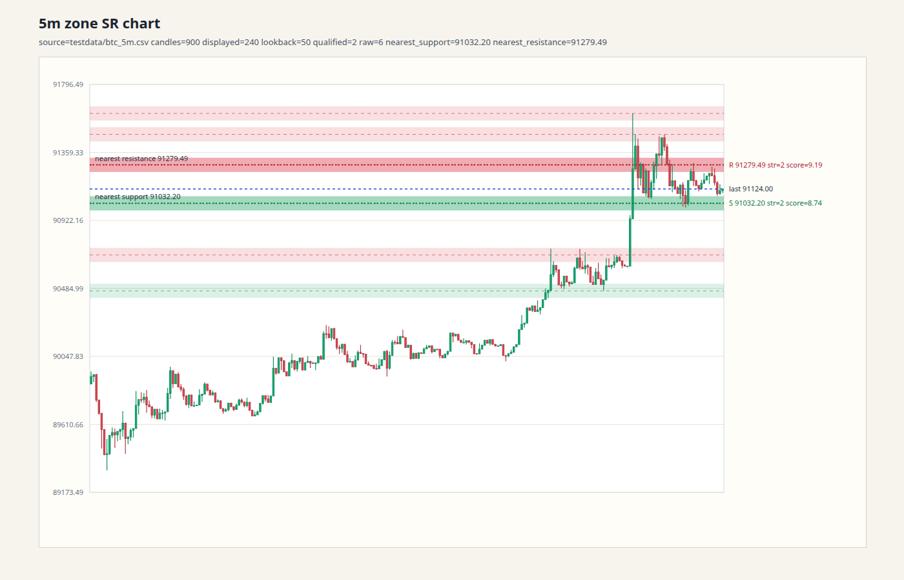

# `go-sr`

[](https://github.com/laclance/go-sr/actions/workflows/ci.yml)
[](https://pkg.go.dev/github.com/laclance/go-sr)
[](https://goreportcard.com/report/github.com/laclance/go-sr)
[](LICENSE)

**Deterministic, closed-candle support/resistance detection for Go trading systems.**

`go-sr` is a focused Go module for support/resistance detection that is designed for backtests and live systems where reproducibility and no-lookahead behavior matter.

- Deterministic results for the same candle prefix and options
- Closed-candle inputs and confirmation-based zone pivots
- Legacy line-based and ATR-aware zone modes
- Nearest support/resistance metadata for strategy logic
- Multi-timeframe candle aggregation and sizing helpers
- No third-party runtime dependencies
- CI with race detection, static analysis, 100% statement coverage, and fuzz smoke tests

## Example



*Zone-mode output generated from the repository's BTC 5m fixture. The preview shows detected support/resistance structure, qualified zones, and nearest levels.*

## Install

```bash
go get github.com/laclance/go-sr@latest
```

```go
import sr "github.com/laclance/go-sr"
```

## Quick Start

```go
levels, err := sr.Compute(candles, sr.Options{
    Timeframe:   "5m",
    Lookback:    120,
    Mode:        sr.ModeZones,
    MinStrength: 2,
})
if err != nil {
    return err
}

fmt.Printf("support=%.2f resistance=%.2f\n",
    levels.NearestSupport,
    levels.NearestResistance,
)
```

`candles` is a slice of closed OHLCV candles:

```go
[]sr.Candle{
    {
        OpenTime:  openTime,
        CloseTime: closeTime,
        Open:      100.0,
        High:      103.0,
        Low:       99.0,
        Close:     102.0,
        Volume:    1250,
    },
}
```

The result includes the detected levels plus strategy-friendly nearest-level metadata:

```go
levels.Levels
levels.NearestSupport
levels.NearestResistance
levels.NearestSupportDistance
levels.NearestResistanceDistance
levels.NearestSupportStrength
levels.NearestResistanceStrength
levels.NearestSupportScore
levels.NearestResistanceScore
levels.NearSupport
levels.NearResistance
```

## Why `go-sr`?

Many trading implementations accidentally make support/resistance look better in backtests by allowing future candles to influence historical pivots. `go-sr` is built around prefix-stable, confirmation-based behavior so the same candle history produces the same result whether it is processed in a backtest or a live strategy.

That makes it a good fit when you need S/R as a dependable input rather than a chart-only visual indicator.

## Modes

### Zone mode

```go
levels, err := sr.Compute(candles, sr.Options{
    Timeframe:   "5m",
    Lookback:    120,
    Mode:        sr.ModeZones,
    MinStrength: 2,
})
```

Zone mode clusters confirmed swing pivots into support/resistance zones. `MinStrength` filters qualified zones; values <= 0 use the default of `2`.

### Legacy mode

```go
levels, err := sr.Compute(candles, sr.Options{
    Timeframe: "5m",
    Lookback:  120,
    Mode:      sr.ModeLegacy,
    Tolerance: 0.002,
})
```

Legacy mode provides line-based S/R behavior. `Tolerance` applies only to legacy mode; values <= 0 use the default `0.002`.

## Multi-Timeframe Support

Aggregate lower-timeframe candles before computing higher-timeframe S/R:

```go
candles15m := sr.AggregateCandlesToTimeframe(candles5m, "5m", "15m")

levels15m, err := sr.Compute(candles15m, sr.Options{
    Timeframe: "15m",
    Lookback:  50,
    Mode:      sr.ModeZones,
})
```

Helpers are also available for calculating warmup and exchange-fetch requirements:

```go
warmup := sr.WarmupCandles(50, sr.ModeZones)
limit := sr.RequiredKlineLimit("5m", "1h", 50, sr.ModeZones)
```

## Public API

```go
type Mode string

const (
    ModeLegacy Mode = "legacy"
    ModeZones  Mode = "zone"
)

type Options struct {
    Timeframe   string
    Lookback    int
    Mode        Mode
    Tolerance   float64
    MinStrength int
}

func Compute(candles []Candle, opts Options) (Levels, error)
func EmptyLevels(timeframe string) Levels
func AggregateCandlesToTimeframe(candles []Candle, fromInterval, toInterval string) []Candle
func WarmupCandles(lookback int, mode Mode) int
func RequiredKlineLimit(baseInterval, targetInterval string, lookback int, mode Mode) int
```

See the runnable examples in [`examples_test.go`](examples_test.go) and the generated API documentation on [pkg.go.dev](https://pkg.go.dev/github.com/laclance/go-sr).

## Behavioral Contract

- `Compute` is deterministic for the same candle prefix and options.
- `Compute` returns an empty level bundle and an error for an unknown `Mode`.
- Zone-mode pivots are confirmation-based; no future candles are read beyond the current prefix.
- `AggregateCandlesToTimeframe` uses UTC-aligned buckets and drops leading/trailing partial buckets.
- `RequiredKlineLimit` returns the raw-candle count needed to build a higher-timeframe S/R bundle and includes one extra live candle for exchange REST responses.
- Supported interval strings use `<n><unit>` with `m`, `h`, or `d`; the target interval must be larger than and evenly divisible by the base interval.
- `NearSupport` / `NearResistance` describe whether the nearest level on each side is within the mode-specific near threshold.
- In zone mode, the near threshold is `2 ×` the zone half-width; zero-width zones fall back to `0.1%` of the current price.
- In legacy mode, the near threshold is `Tolerance × close`.

## Scope

This module owns:

- Closed-candle S/R detection
- Legacy line-based and zone-based S/R modes
- Deterministic nearest support/resistance metadata
- S/R-specific multi-timeframe aggregation, warmup sizing, and fetch sizing

This module intentionally does **not** own:

- Exchange or Binance parsing
- Strategy scoring or trade evaluation
- App-specific timeframe policy
- Order execution

Keeping exchange and strategy concerns outside the package makes `go-sr` usable across backtest engines, bots, and brokers.

## Manual Chart Inspection

The repository includes a BTC fixture and an HTML chart generator for visually inspecting detected zones:

```bash
GO_SR_CHART=/tmp/go-sr-btc-5m.html \
  go test -run TestGenerateManualSRChart -count=1 -v

xdg-open /tmp/go-sr-btc-5m.html
```

Optional overrides:

```bash
GO_SR_CHART_TIMEFRAME=15m
GO_SR_CHART_MODE=legacy
GO_SR_CHART_LOOKBACK=80
GO_SR_CHART_WINDOW=300
GO_SR_CHART_MIN_STRENGTH=1
```

## Quality Gate

CI runs on every push and pull request and requires:

- `gofmt`
- `go test ./...`
- `go test -race ./...`
- `go vet ./...`
- `staticcheck ./...`
- `golangci-lint run`
- `100.0%` statement coverage
- Fuzz smoke tests for aggregation and compute invariants

## Contributing

Issues and pull requests are welcome. See [`CONTRIBUTING.md`](CONTRIBUTING.md) before making a change, and use [`SECURITY.md`](SECURITY.md) for security reports.

If you are using `go-sr` in a project, opening a discussion or issue with your use case is also useful feedback for the API.

## License

Apache-2.0. See [`LICENSE`](LICENSE).
